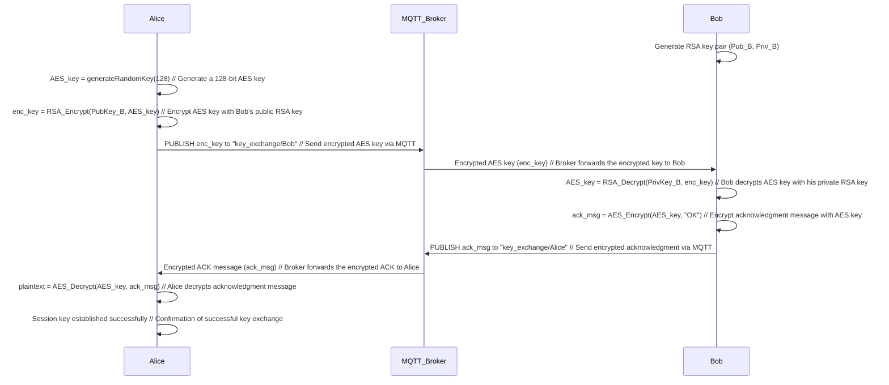
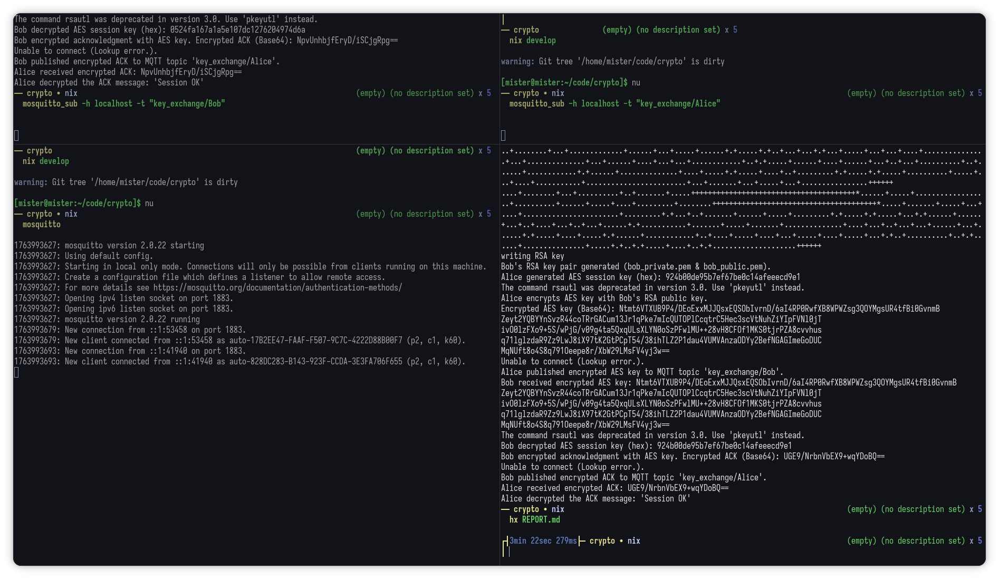

### Hybrid RSA-AES Session Key Exchange Simulation (via MQTT)

---

#### **Introduction**

This report demonstrates the use of hybrid encryption combining **RSA** (asymmetric encryption) and **AES** (symmetric encryption) to securely exchange a session key over **MQTT**. In hybrid encryption, RSA is used to securely exchange an AES key, which is then used for fast and efficient data encryption during the communication session. MQTT, a lightweight messaging protocol, serves as the transport layer, with custom encryption ensuring security end-to-end.

---

#### **Key Exchange Process Overview**

1. **RSA Key Generation (Bob)**: Bob generates an RSA key pair (public and private keys).
2. **AES Session Key Generation (Alice)**: Alice generates a random AES session key (128-bit).
3. **Encrypting AES Key with RSA (Alice)**: Alice encrypts the AES key using Bob's RSA public key.
4. **Transmitting the Encrypted Key (Alice -> Bob)**: Alice sends the encrypted AES key via MQTT to Bob.
5. **Decrypting the AES Key (Bob)**: Bob decrypts the AES key using his RSA private key.
6. **AES Encryption for Acknowledgment (Bob)**: Bob encrypts an acknowledgment message with the AES key and sends it back to Alice.
7. **Decryption and Confirmation (Alice)**: Alice decrypts the acknowledgment, confirming that the AES key was exchanged successfully.

---

#### **Sequence Diagram of Key Exchange**

Below is the Mermaid sequence diagram representing the RSA-AES key exchange process:



---

#### **Key Outputs**

1. **Bob's RSA Key Pair**:

   * **Public Key**: `bob_public.pem`
   * **Private Key**: `bob_private.pem`

2. **AES Key** (hexadecimal): `924b00de95b7ef67be0c14afeeecd9e1`

3. **Encrypted AES Key** (Base64):

   * Example output:

     ```
     Ntmt6VTXUB9P4/DEoExxMJJQsxEQSObIvrnD/6aI4RP0RwfXB8WPWZsg3QOYMgsUR4tfBi0GvnmB...
     ```

4. **Decrypted AES Key** (hexadecimal):

   * Example output:

     ```
     924b00de95b7ef67be0c14afeeecd9e1
     ```

5. **Encrypted Acknowledgment** (Base64):

   * Example output:

     ```
     UGE9/NrbnVbEX9+wqYDoBQ==
     ```

6. **Decrypted Acknowledgment**: "Session OK"

---

#### **Conclusion**

The RSA-AES hybrid key exchange using MQTT was successfully simulated. Alice and Bob securely exchanged an AES session key using RSA for key exchange and AES for subsequent encrypted communication. Despite MQTT’s lack of inherent encryption, the use of RSA and AES ensured that all sensitive data was transmitted securely.

By utilizing this approach, we demonstrate a practical example of securely sharing a symmetric key over an insecure channel, which is a critical component of many secure communication protocols.

---

#### **Screenshots**

**Add your screenshot here showing the output of the key exchange:**


